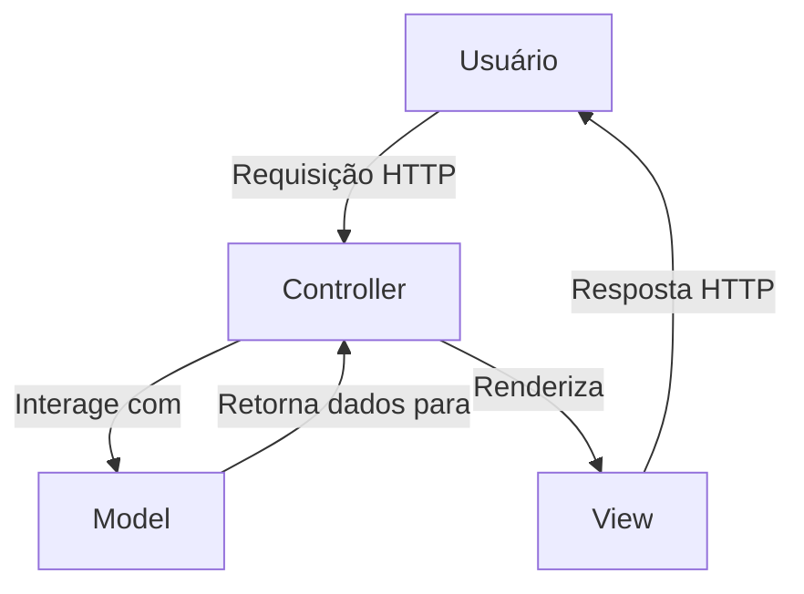

```
   _________   _____________ ___________.__                 __      _____                 
  /     \   \ /   /\_   ___ \\_   _____/|  | _____    _____|  | __ /  _  \ ______ ______  
 /  \ /  \   Y   / /    \  \/ |    __)  |  | \__  \  /  ___/  |/ //  /_\  \\____ \\____ \ 
/    Y    \     /  \     \____|     \   |  |__/ __ \_\___ \|    </    |    \  |_> >  |_> >
\____|__  /\___/    \______  /\___  /   |____(____  /____  >__|_ \____|__  /   __/|   __/ 
        \/                 \/     \/              \/     \/     \/       \/|__|   |__|    
```

## Infos:


## Ferramentas:


---

## 📌 Índice

1. [Introdução](#introdução)
2. [Objetivos do Projeto](#objetivos-do-projeto)
3. [Arquitetura do Projeto](#arquitetura-do-projeto)
4. [Estrutura de Diretórios](#estrutura-de-diretórios)
5. [Tecnologias Utilizadas](#tecnologias-utilizadas)
6. [Funcionalidades Implementadas](#funcionalidades-implementadas)
7. [Como Executar o Projeto](#como-executar-o-projeto)
8. [Participantes do Projeto](#participantes-do-projeto)
9. [Considerações Finais](#considerações-finais)

---

## 🚀 Introdução

O **MVCFlaskApp** é uma aplicação web desenvolvida com o framework Flask, seguindo a arquitetura **MVC (Model-View-Controller)**. O projeto tem como objetivo demonstrar a implementação de uma aplicação web funcional com operações CRUD (Create, Read, Update, Delete), permitindo o gerenciamento de usuários e produtos. Além disso, adota boas práticas de organização de código, com separação clara entre as camadas da aplicação.

---

## 🎯 Objetivos do Projeto

- Criar uma aplicação web simples para gerenciar usuários e produtos.
- Implementar as operações CRUD essenciais.
- Adotar a arquitetura MVC para organização do código.
- Utilizar o banco de dados SQLite integrado ao Flask.
- Desenvolver uma interface responsiva e de fácil utilização.

---

## 🧱 Arquitetura do Projeto

A arquitetura do projeto segue o padrão **MVC (Model-View-Controller)**, conforme ilustrado abaixo:



- **Model**: Responsável pela manipulação de dados e interações com o banco de dados. Representado pela classe `models.py`.
- **View**: Responsável pela interface com o usuário. Utiliza templates HTML com o motor de templates Jinja2, localizados na pasta `templates/`.
- **Controller**: Responsável pela lógica de controle da aplicação. As rotas e a lógica de renderização das páginas estão centralizadas nos arquivos `controllers.py` e `views.py`.

---

## 📁 Estrutura de Diretórios

```
MVCFLASKAPP/
├── App/
│   ├── __pycache__/                # Cache de compilação Python (automático)
│   ├── static/                     # Arquivos estáticos
│   │   ├── css/                    # Estilos CSS separados por página
│   │   │   ├── page_cadastro.css
│   │   │   ├── page_edit.css
│   │   │   ├── page_list.css
│   │   │   └── style.css
│   │   ├── js/                     # Scripts JS separados por página
│   │   │   ├── edit_product.js
│   │   │   ├── edit_user.js
│   │   │   ├── register_product.js
│   │   │   └── user_register.js
│   ├── templates/                  # Views (HTML com Jinja2)
│   │   ├── edit_product.html
│   │   ├── edit_user.html
│   │   ├── index.html
│   │   ├── product_list.html
│   │   ├── register_product.html
│   │   ├── user_list.html
│   │   └── user_register.html
│   ├── __init__.py                 # Inicialização do pacote Flask
│   ├── controllers.py              # Controladores (rotas e lógica intermediária)
│   ├── crud.py                     # Operações CRUD (Create, Read, Update, Delete)
│   ├── models.py                   # Definições de modelos (tabelas/banco)
│   └── views.py                    # Lógica de renderização e retorno de templates
├── database_teste_mvc.db           # Banco de dados SQLite
├── main.py                         # Arquivo principal para rodar a app
├── requirements.txt                # Dependências do projeto
├── README.md                       # Documentação
├── LICENSE                         # Licença do projeto
└── .gitignore                      # Ignora arquivos desnecessários no Git
```

---

## 🛠️ Tecnologias Utilizadas

- **Python**: Linguagem de programação principal.
- **Flask**: Framework web para desenvolvimento de aplicações em Python.
- **HTML**: Utilizado para estruturar as páginas web.
- **CSS**: Para estilizar a interface web.
- **JavaScript**: Para manipulação dinâmica da interface do usuário.
- **SQLite**: Banco de dados leve, integrado ao Flask.

---

## ✅ Funcionalidades Implementadas

- **Cadastro de Usuários e Produtos**: Permite registrar novos usuários e produtos no sistema.
- **Listagem de Usuários e Produtos**: Exibe uma lista de usuários e produtos cadastrados.
- **Edição de Usuários e Produtos**: Permite editar os dados dos usuários e produtos.
- **Exclusão de Usuários e Produtos**: Permite excluir usuários e produtos do sistema.
- **Banco de Dados**: Utiliza SQLite para armazenar dados de usuários e produtos.

---

## 🧪 Como Executar o Projeto

1. **Clone o Repositório**:

   ```bash
   git clone https://github.com/sh1ftx/MVCFlaskApp.git
   cd MVCFlaskApp
   ```

2. **Instale as Dependências**:

   Utilize o `pip` para instalar as dependências do projeto:

   ```bash
   pip install -r requirements.txt
   ```

3. **Execute a Aplicação**:

   Inicie o servidor Flask:

   ```bash
   python main.py
   ```

4. **Acesse a Aplicação**:

   Abra o navegador e acesse o endereço local:

   ```
   http://127.0.0.1:5000
   ```

---

## 👥 Participantes do Projeto

- [Gleison Oliveira](https://github.com/gleiSUN)
- [Kayky Rodrigues](https://github.com/xFrostzss)
- [Fernando Sena](https://github.com/FernandosenaDev)
- [Vinycius Huellyson](https://github.com/VINYCIU51)

---

## 📝 Considerações Finais

O **MVCFlaskApp** foi desenvolvido para demonstrar como aplicar a arquitetura MVC em uma aplicação web simples, utilizando Flask e SQLite. Ele serve como base para aplicações mais complexas, podendo ser estendido para incluir novas funcionalidades como autenticação de usuários, validação de formulários e integração com outros bancos de dados.

A separação clara entre as camadas da aplicação torna o código mais organizado e facilita a manutenção. O uso de Flask, Jinja2 e SQLite proporciona uma base sólida e fácil de entender para desenvolvedores iniciantes em Python.

---
